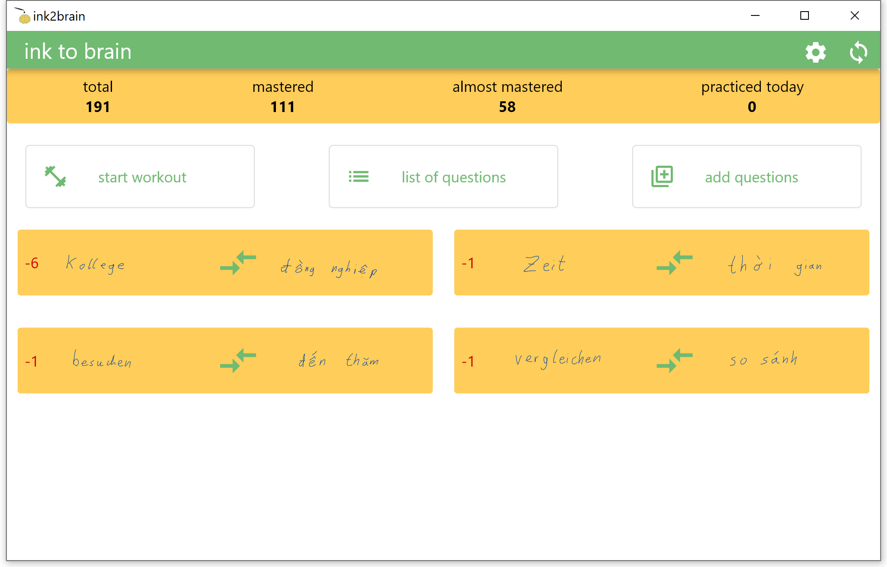
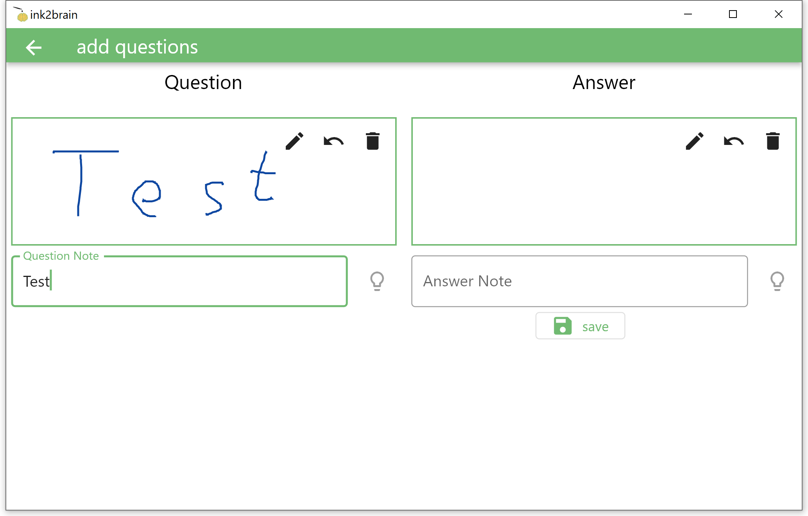

# ink 2 brain

this is the result of major procrastination... A app that stores vocabulary or question answer flashcards. The special thing is: it is stored in your handwriting. So you can add drawings or character sets that are unusual. There is also a workout, where you are asked the questions and can see if you are able to reproduce the solution from your memory. If answered correct for a number of times you wont be bothered with the same question anymore.

## features

* word database in e-ink: question -> answer
* basic tesseract ink to text for new questions
* workout, train questions
  * ask 15 questions, repeat until all are correct
  * correct answers are stored, if correct for a specific number of times over a specific number of days its marked as learned, wont be asked again
* nextcloud database backup and restore (use on different devices)

## supported devices

* windows
* android

## transfer/backup database

* use nextcloud sync.
* or
  * windows
    * the database is located in the same directory as the executable: *words.db*
  * android
    * the database is stored in Android/data/com.

## screenshots

